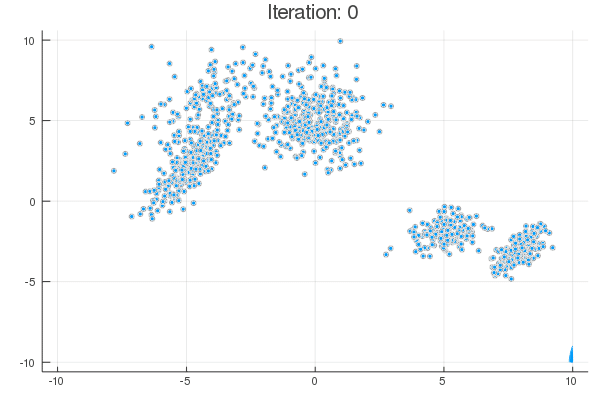

# ベイズ推論の実装メモ

:sushi:

## 混合ガウスモデル (Gaussian Mixture Model: GMM)

* [GMMのギプスサンプリングの実装](https://nbviewer.jupyter.org/github/eqs/Bayes-Notebooks/blob/master/GMM/GS_GMM.ipynb)
  * 参考：須山, ベイズ推論による機械学習入門, 講談社, 2017.

## ディリクレ過程混合ガウスモデル (Dirichlet Process GMM: DPGMM)

* [DPGMMのギプスサンプリングの実装](https://nbviewer.jupyter.org/github/eqs/Bayes-Notebooks/blob/master/DPGMM/GS_DPGMM.ipynb)
  * 参考：石井, 上田, 続・わかりやすいパターン認識―教師なし学習入門―, オーム社, 2014.

## 無限関係モデル (Infinite Relational Model: IRM)

* [トイデータの生成](https://nbviewer.jupyter.org/github/eqs/Bayes-Notebooks/blob/master/IRM/IRM_data.ipynb)
* [IRMの実装](https://nbviewer.jupyter.org/github/eqs/Bayes-Notebooks/blob/master/IRM/CGS_IRM.ipynb)
  * 参考：石井, 上田, 続・わかりやすいパターン認識―教師なし学習入門―, オーム社, 2014.

## 主成分分析 (Principal Component Analysis: PCA)

* [PCAのギプスサンプリングの実装](https://nbviewer.jupyter.org/github/eqs/Bayes-Notebooks/blob/master/PCA/GS_PCA.ipynb)
  * 参考：須山, ベイズ推論による機械学習入門, 講談社, 2017.
